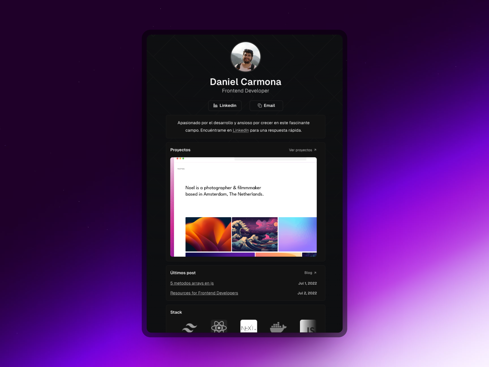

## ⚒ Stack

- [**Astro**](https://nextjs.org/) - The web framework that scales with you.
- [**Tailwind CSS**](https://tailwindcss.com/) - A utility-first CSS framework.

## 🎉 Deploys

- ✅ Front-End : [Vercel](https://vercel.com/)
